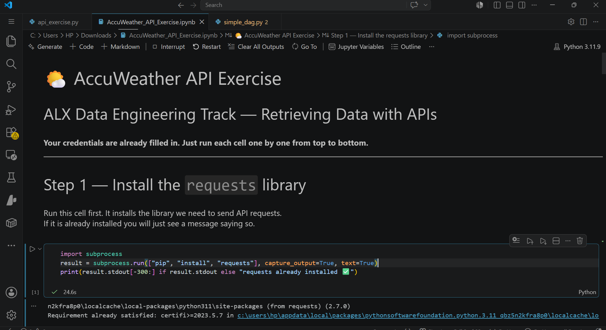

# 🌤️ AccuWeather API Data Pipeline


## 📌 Project Overview
This project demonstrates how to **consume a real-world weather API**, extract meaningful data, and store it persistently — a core skill in Data Engineering.

As part of the **ALX Data Engineering Track**, I built a Python script using the AccuWeather API to fetch current weather conditions for Warri, Nigeria, process the JSON response, and log the data into a CSV file.

---

## 🖼️ Project Screenshots



> *Screenshot of the completed Jupyter Notebook showing successful API call, data extraction, and CSV logging.*

---

## 🔧 Technologies Used
- **Python** — Core scripting
- **Requests** — Making HTTP GET requests to the API
- **JSON** — Parsing API responses
- **Pandas** — Displaying data in clean tables
- **CSV** — Persistent data storage
- **Jupyter Notebook** — Development & documentation

---

## ✨ What I Built

- Connected to **AccuWeather Current Conditions API**
- Fetched real-time weather data (Temperature, Humidity, Wind, UV Index, etc.)
- Cleaned and extracted relevant fields from complex nested JSON
- Saved weather readings to `weather_log.csv` (with timestamp)
- Built an automated fetching loop (every 2 hours)

### Key Features:
- Proper error handling for API responses
- Formatted output display
- Data persistence for future analysis
- Ready for scheduling (can become a production data pipeline)

---

## 📊 Sample Output

**Current Weather (Warri):**
- Temperature: 24.3°C / 76.0°F
- Condition: Cloudy
- Humidity: 89%
- Wind: 7.5 km/h West

---

## 💡 What I Learned
- How to securely work with API keys
- Parsing complex nested JSON responses
- Building simple ETL pipelines (Extract → Transform → Load)
- Logging data over time for analysis
- Best practices for working with third-party APIs

---

## 🚀 How to Run

1. Clone the repository
2. Install requirements:
   ```bash
   pip install requests pandas

Open the file AccuWeather_API_Exercise.ipynb and run all cells one by one from top to bottom.

⚠️ Note: Your personal API key is already included in the notebook for this exercise.

👤 Author
Wisdom Oghenevwede Uti


⭐ If this project helped you, feel free to star the repository!
   
